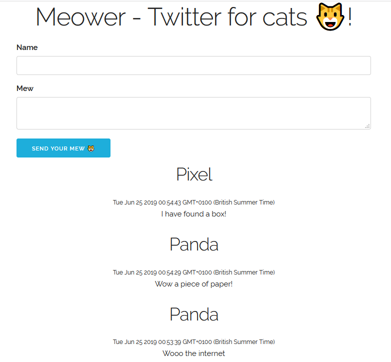

# Twitter for cats
Exactly what the name says (this is a twitter for cats).  
After a while I realized that this idea is not too great as my cats have absolutely no interest in tweeting or using the computer.

Just a silly experiment done while following:   
https://www.youtube.com/watch?v=JnEH9tYLxLk

Instead of node.js I used flask and instead of mongo I used dynamodb.

